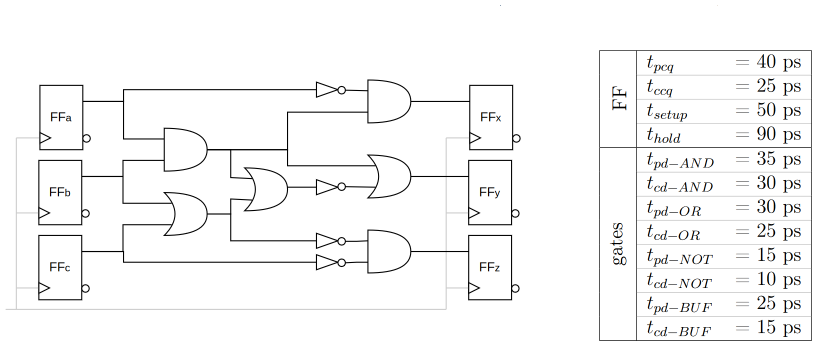
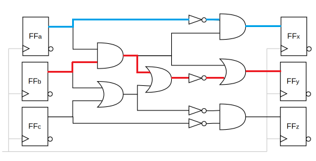
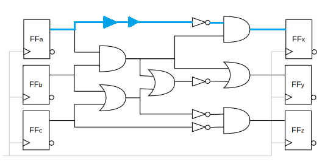

# Computer Architecture

---

## Übung 04

### Aufgabe 03 - Timing Analyse

---

> Gegeben ist folgende Schaltung und Verzögerungszeiten der FFs und Gatter. Alle FFs sind mit dem selben Clock verbunden (in grau).
> 
> 
> 
> Berechne
> 
>     a) den längsten komb. Pfad ($\color{red}t_{pd}$) und
> 
> b) den kürzesten komb. Pfad ($\color{aqua}t_{cd}$) der Schaltung
> 
> und markiere diese in der Schaltung.
> 
> c) Ermittle den maximalen Takt mit dem das Setup Time Constraint noch eingehalten werden kann. *Hinweis: Einheiten nicht vergessen.*
> 
> d) Kann das Hold Time Constraint eingehalten werden? Falls nicht ändere die Schaltung mithilfe von Buffern und gib die aktualisierten Minimal-Verzögerungen an. **Füge Buffer so ein, dass die Maximale Verzögerungszeit nicht verändert wird!**

a.)

*$t_{pd}$ in rot markiert, $t_{cd}$ in blau*

$t_{pd} = t_{pd - AND} + t_{pd-OR} + t_{pd-NOT} + t_{pd-OR} \\ t_{pd} = 35 \ ps + 30 \ ps + 15 \ ps + 30 \ ps = 110 \ ps $

b.)

$t_{cd} = t_{cd-NOT} + t_{cd-AND} \\ t_{cd} = 10 \ ps + 30 \ ps = 40 \ ps$

c.)

$T_c \geq t_{pd} + t_{pcd} + t_{setup} \\ T_c \geq 110 \ ps + 40 \ ps + 50 \ ps \\ T_c \geq 200 \ ps \\ f_c \leq \frac{1}{200 \ ps} \\ f_c \leq 5 \ GHz$

Der maximale Takt bei dem das Setup Time Constraint noch eingehalten werden kann beträgt $5 \ GHz$.

d.)

$t_{ccq} + t_{cd} > t_{hold} \\ 25 \ ps + 40 \ ps > 90 \ ps \\ 65 \ ps > 90 \ ps$

Hold Time Constraint kann nicht eingehalten werden.

**Einfügen von Buffern:**

$t_{cd} = t_{cd-NOT} + t_{cd-AND} + 2\cdot t_{cd-BUF} = 10 \ ps + 30 \ ps + 30 \ ps = 70 \ ps$

$25 \ ps + 70 \ ps > 90 \ ps$

$95 \ ps > 90 \ ps$

Hold Time Constraint erfüllt

---
